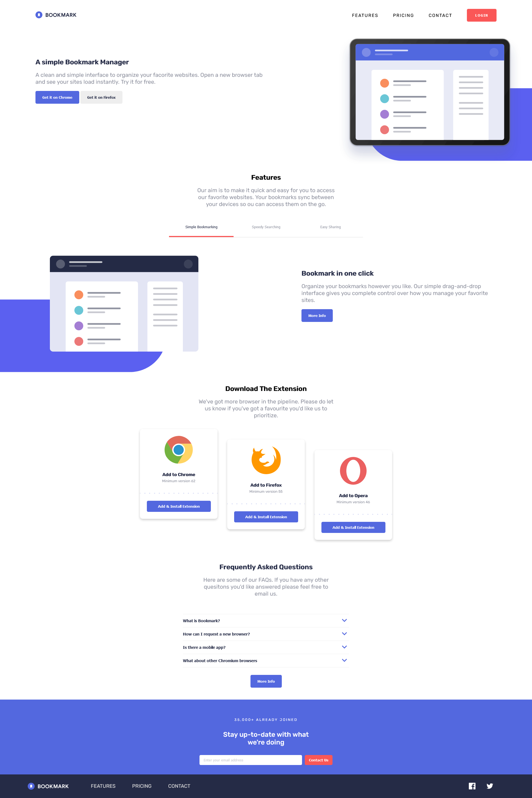
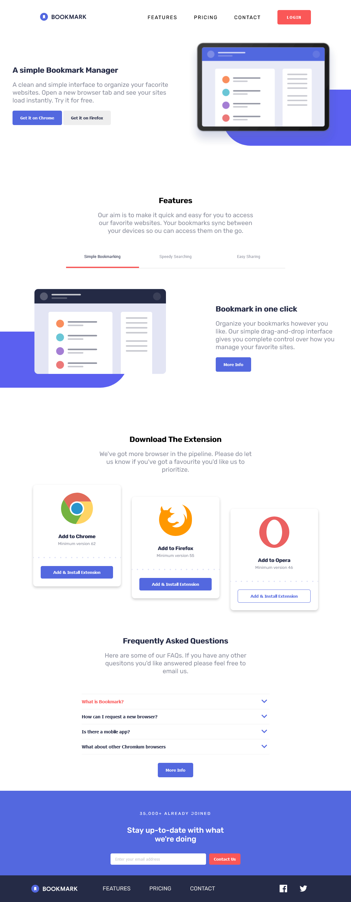
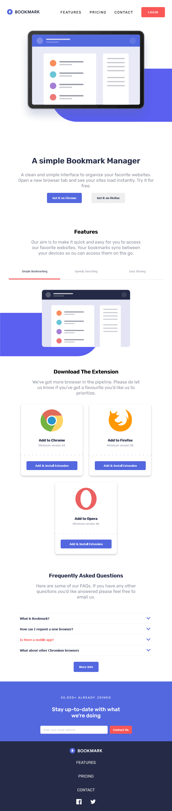
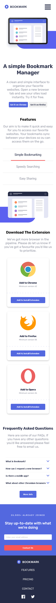

# Project Overview

## Table of contents

-  [Overview](#overview)
   -  [Features](#features)
   -  [Screenshots](#screenshots)
   -  [Links](#links)
-  [My process](#my-process)
   -  [Built with](#built-with)
   -  [What I learned](#what-i-learned)
   -  [Continued development](#continued-development)
   -  [Useful resources](#useful-resources)
-  [Author](#author)

## Overview

### Features

Users should be able to:

- View the optimal layout for the site depending on their device's screen size
- See hover states for all interactive elements on the page
- Receive an error message when the newsletter form is submitted if:
  - The input field is empty
  - The email address is not formatted correctly

### Screenshots

***Big Layout***\

***Medium Layout***\

***Small Layout***\

***Mobile Layout***\

### Links

- Solution URL: [Github Respository](https://github.com/jordan-na/bookmark-landing-page-responsive.git)
- Live Site URL: [Hosted on Github Pages](https://jordan-na.github.io/bookmark-landing-page/)

## My process

### Built with

- Semantic HTML5 markup
- CSS custom properties
- Flexbox
- CSS Grid
- Desktop-first workflow
- Vanilla JS
- ES6 module patterns with IIEF's

### What I learned

-  Non-technical skills:

   -  How to turn an abstract concept into concrete results by breaking the task at hand into smaller tasks
   -  Ability to plan and stick to a work schedule with an estimated date of completion
      -  Day 1: Create desktop design (HTML, CSS)
      -  Day 2: Create mobile design (HTML, CSS)
      -  Day 3: Implement vanilla JS
   -  Perserverance to finish the task, even through challenging times

-  Technical skills:
   -  Responsive UI/UX development
      -  Using the chrome inspector to emulate different screen sizes
   -  Using CSS grid to create responsive and dynamic layouts
   -  CSS media queries

### Continued development

-  I will continue to refine my vanilla JS and no-framwork CSS approach before moving onto libraries/frameworks
-  After I have complete a multitude of no library/framework projects, I will learn _React_ and implement it with my knowledge of _Node.js_ and _Express.js_
- Eventually, the goal is to complete a full stack web app that has a use for society

### Useful resources

-  [MDN](https://developer.mozilla.org/en-US/docs/Web/JavaScript) - This helped me by acting as a reference for the built in js API

## Author

-  Name: Jordan Na
-  Website - [Github Profile](https://github.com/jordan-na)
-  Frontend Mentor - [@jordan-na](https://www.frontendmentor.io/profile/jordan-na)
-  Email - jordster02@gmail.com
